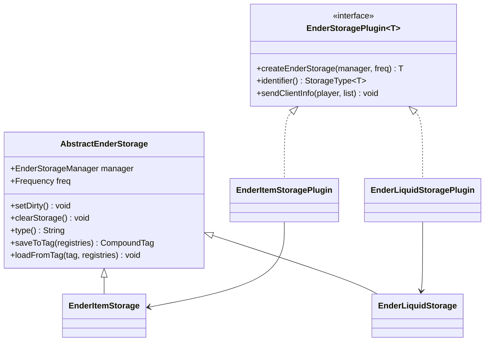
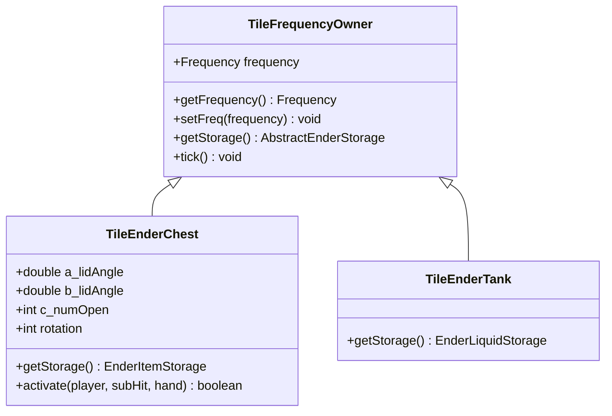
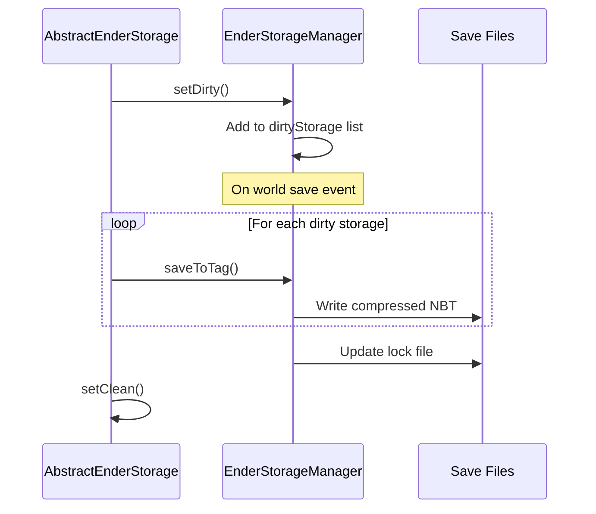
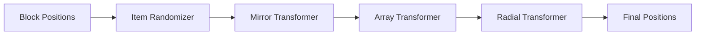
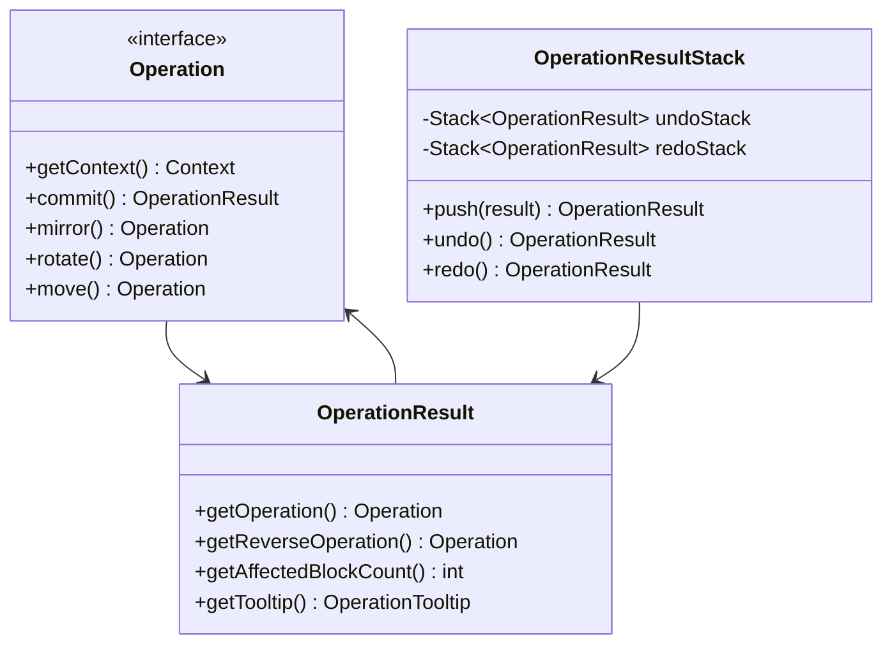
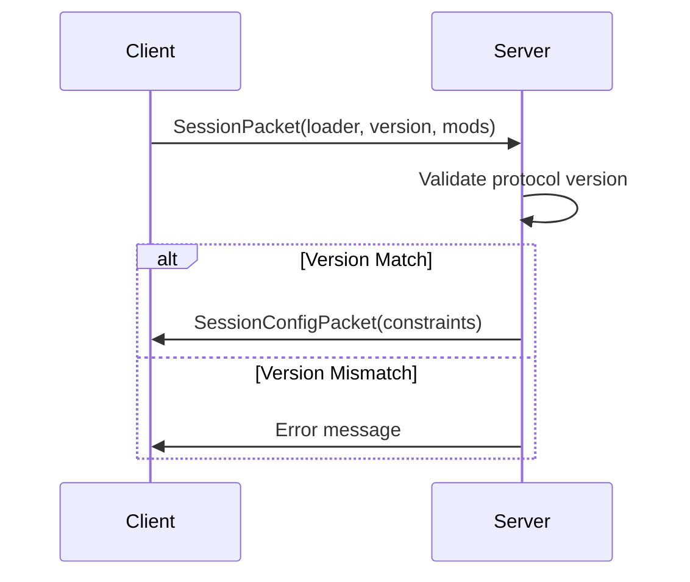

# Mod Analysis Documentation

This document analyzes the architecture and patterns used in IronChests and EnderStorage mods for reference in developing the Logistic Pipes 2 mod.

---

# IronChests Mod Analysis

**Version Information (Checked: February 12, 2026)**
- **Latest Version**: 1.21.11-neoforge-16.7.3
- **Latest Minecraft Version**: 1.21.11
- **Supported Loaders**: NeoForge (Forge for older versions)
- **Source**: [CurseForge](https://www.curseforge.com/minecraft/mc-mods/iron-chests) | [Modrinth](https://modrinth.com/mod/iron-chests)

## Project Structure Overview

Key files:
- `IronChestsTypes.java` - Enum defining chest sizes
- `AbstractIronChestBlockEntity.java` - Base block entity with inventory
- `IronChestMenu.java` - Container/Menu handling

## Key Pattern: Enum-Driven Configuration

The `IronChestsTypes` enum is the single source of truth:
- `size` - Total inventory slots
- `rowLength` - Slots per row
- `xSize`, `ySize` - GUI dimensions
- `guiTexture` - GUI texture path

## Chest Size Progression

| Type | Slots | Rows × Columns |
|------|-------|----------------|
| Copper | 45 | 5 × 9 |
| Iron | 54 | 6 × 9 |
| Gold | 81 | 9 × 9 |
| Diamond/Crystal/Obsidian | 108 | 9 × 12 |

## How Inventory Size Works

1. Enum defines `size` property
2. `AbstractIronChestBlockEntity` creates `NonNullList.withSize(chestType.size, ItemStack.EMPTY)`
3. `IronChestMenu` dynamically generates slot grid
4. `IronChestScreen` renders GUI with correct dimensions

---

# EnderStorage Mod Analysis

**Version Information (Checked: February 12, 2026)**
- **Latest Version**: 2.13.0.191
- **Latest Minecraft Version**: 1.21.1
- **Supported Loaders**: NeoForge (Forge for older versions)
- **Dependency**: CodeChickenLib
- **Source**: [CurseForge](https://www.curseforge.com/minecraft/mc-mods/ender-storage-1-8) | [Modrinth](https://modrinth.com/mod/ender-storage)

## Project Structure Overview

```
src/main/java/codechicken/enderstorage/
├── api/                    # Core API interfaces and classes
│   ├── AbstractEnderStorage.java    # Base storage class
│   ├── EnderStoragePlugin.java      # Plugin interface for storage types
│   ├── Frequency.java               # Color-based identification system
│   └── StorageType.java             # Type identifier record
├── manager/
│   └── EnderStorageManager.java     # Central storage manager
├── storage/
│   ├── EnderItemStorage.java        # Item storage implementation
│   └── EnderLiquidStorage.java      # Fluid storage implementation
├── tile/
│   ├── TileFrequencyOwner.java      # Base tile entity
│   ├── TileEnderChest.java          # Chest tile entity
│   └── TileEnderTank.java           # Tank tile entity
├── block/
│   ├── BlockEnderStorage.java       # Base block class
│   ├── BlockEnderChest.java         # Chest block
│   └── BlockEnderTank.java          # Tank block
├── container/
│   └── ContainerEnderItemStorage.java  # Container/Menu
├── plugin/
│   ├── EnderItemStoragePlugin.java  # Item storage plugin
│   └── EnderLiquidStoragePlugin.java # Liquid storage plugin
└── config/
    └── EnderStorageConfig.java      # Configuration
```

## Key Pattern: Frequency System

The [`Frequency`](F:\Minecraft modding\Mod Github\EnderStorage\src\main\java\codechicken\enderstorage\api\Frequency.java) class is the core identification mechanism:

```java
public record Frequency(
    EnumColour left,      // First color
    EnumColour middle,    // Second color  
    EnumColour right,     // Third color
    Optional<UUID> owner, // Optional owner UUID
    Optional<Component> ownerName  // Optional owner display name
) { }
```

### Frequency Features:
- **3-color code**: 16³ = 4,096 possible combinations
- **Owner binding**: Optional personal storage (requires "personal item" to lock)
- **Immutable design**: Uses `withX()` methods to create modified copies

## Key Pattern: Plugin Architecture

The mod uses a plugin system for extensible storage types:



## Key Pattern: Central Storage Manager

[`EnderStorageManager`](F:\Minecraft modding\Mod Github\EnderStorage\src\main\java\codechicken\enderstorage\manager\EnderStorageManager.java) is the single point of access:

### Core Responsibilities:
1. **Storage Lifecycle**: Creates and caches storage instances
2. **Persistence**: Saves/loads storage data to world save directory
3. **Client/Server Sync**: Maintains separate client and server managers
4. **Plugin Registration**: Registers storage type plugins

### Storage Retrieval Pattern:
```java
// Get storage by frequency and type
EnderItemStorage storage = EnderStorageManager.instance(isClientSide)
    .getStorage(frequency, EnderItemStorage.TYPE);
```

### Storage Key Format:
```
"left=COLOR,middle=COLOR,right=COLOR,owner=UUID,type=typename"
```

## Storage Implementations

### EnderItemStorage

| Size Index | Slots | Dimensions |
|------------|-------|------------|
| 0 | 9 | 3×3 |
| 1 (default) | 27 | 3×9 |
| 2 | 54 | 6×9 |

Key features:
- Implements `Container` interface
- Tracks open count for animation sync
- Dynamic size alignment when config changes
- Thread-safe with synchronized blocks

### EnderLiquidStorage

- **Capacity**: 16 buckets (16 × 1000 mB = 16,000 mB)
- Implements `IFluidHandler` and `IFluidTank`
- Uses NeoForge's `FluidTank` internally

## Tile Entity Architecture



### TileFrequencyOwner Features:
- Stores frequency in NBT
- Syncs frequency to client via packets
- Monitors storage change count for comparator updates
- Handles dye interactions for frequency changes

## Block Architecture

[`BlockEnderStorage`](F:\Minecraft modding\Mod Github\EnderStorage\src\main\java\codechicken\enderstorage\block\BlockEnderStorage.java) base class handles:

1. **Dye Interaction**: Click with dye to change frequency colors
2. **Personal Item Interaction**: Shift-click with diamond (configurable) to bind/unbind owner
3. **Drop Handling**: Drops item with frequency data, optionally drops personal item
4. **Redstone**: Comparator output support
5. **Rotation**: Wrench-style rotation support

### Sub-hit Ray Tracing:
The mod uses sub-hit ray tracing for precise interaction:
- `subHit 1-3`: Color buttons (left, middle, right)
- `subHit 4`: Owner button

## Data Persistence

### Save System:
- Location: `<world>/EnderStorage/`
- Files: `data1.dat`, `data2.dat`, `lock.dat`
- Uses alternating file writes for crash safety
- Compressed NBT format

### Save Flow:


## Configuration Options

| Option | Default | Description |
|--------|---------|-------------|
| `personalItem` | `minecraft:diamond` | Item used to lock storage to a player |
| `anarchyMode` | `false` | Drops personal item and clears owner on break |
| `item_storage_size` | `1` | Storage size: 0=9, 1=27, 2=54 slots |
| `disableCreatorVisuals` | `false` | Disables tank on creator's head |
| `useVanillaEnderChestsSounds` | `false` | Use vanilla ender chest sounds |

## Key Takeaways for Logistic Pipes 2

### Applicable Patterns:

1. **Frequency System**: Could be adapted for pipe network channels/identifiers
2. **Plugin Architecture**: Extensible storage types could work for pipe modules
3. **Central Manager Pattern**: Single point of access for network state
4. **Immutable Configuration**: Using records and `withX()` methods for clean mutations

### Architecture Decisions:

| Pattern | EnderStorage | Potential Use in LP2 |
|---------|--------------|----------------------|
| Frequency | 3-color code | Network routing channels |
| Plugin System | Storage types | Pipe modules/upgrades |
| Manager | Per-world storage | Network manager |
| Tile Entity | Frequency owner | Pipe tile base |

### Code Quality Notes:
- Clean separation between API and implementation
- Thread-safe storage access with synchronized blocks
- Robust save system with backup mechanism
- Good use of Java records for immutable data

---

# Effortless Mod Analysis

**Version Information (Checked: February 12, 2026)**
- **Latest Version**: 3.4.0
- **Latest Minecraft Version**: 1.21.3
- **Supported Loaders**: Fabric, NeoForge, Quilt (Forge for older versions)
- **Source**: [CurseForge](https://www.curseforge.com/minecraft/mc-mods/effortless) | [Modrinth](https://modrinth.com/mod/effortless)

## Overview

Effortless Structure is a multi-platform building helper mod that allows players to place and break blocks in sophisticated patterns. It supports Fabric, Quilt, Forge, and NeoForge from a single codebase using a custom multi-loader architecture.

## Project Structure Overview

```
src/main/java/dev/huskuraft/effortless/
├── Effortless.java                    # Main entry point (singleton pattern)
├── EffortlessStructureBuilder.java    # Server-side building orchestration
├── EffortlessClient.java              # Client-side handling
├── EffortlessNetworkChannel.java      # Network packet handling
├── EffortlessSessionManager.java      # Client-server session validation
├── building/
│   ├── Context.java                   # Immutable build context (core state)
│   ├── BuildState.java                # Enum: IDLE, BREAK, PLACE, INTERACT, COPY, PASTE
│   ├── BuildType.java                 # BUILD, BUILD_CLIENT, PREVIEW
│   ├── StructureBuilder.java          # Abstract builder interface
│   ├── clipboard/                     # Copy/paste functionality
│   │   ├── Clipboard.java             # Clipboard state container
│   │   ├── Snapshot.java              # Captured block data
│   │   └── BlockData.java             # Individual block snapshot
│   ├── history/
│   │   └── OperationResultStack.java  # Undo/redo stack implementation
│   ├── operation/
│   │   ├── Operation.java             # Core operation interface
│   │   ├── OperationResult.java       # Result with reverse operation
│   │   ├── batch/                     # Batch operations
│   │   └── block/                     # Block-level operations
│   ├── pattern/
│   │   ├── Pattern.java               # Pattern container
│   │   ├── Transformer.java           # Transformation interface
│   │   ├── array/                     # Array repeater
│   │   ├── mirror/                    # Mirror transformer
│   │   ├── raidal/                    # Radial transformer
│   │   └── randomize/                 # Item randomizer
│   ├── session/
│   │   └── BatchBuildSession.java     # Build execution session
│   ├── structure/
│   │   ├── BuildMode.java             # Enum of all build modes
│   │   ├── BuildFeature.java          # Feature interface
│   │   └── builder/
│   │       ├── Structure.java         # Structure interface
│   │       ├── BlockStructure.java    # Block-based structure base
│   │       └── standard/              # Standard shapes (Line, Wall, Cube, etc.)
│   └── replace/                       # Block replacement strategies
├── networking/
│   └── packets/                       # Packet definitions
├── session/
│   ├── Session.java                   # Session data record
│   └── SessionManager.java            # Session validation
└── renderer/                          # Client-side rendering
    ├── outliner/                      # Block outlines
    └── tooltip/                       # Build tooltips
```

## Key Pattern: Immutable Context with Record Pattern

The [`Context`](F:\Minecraft modding\Mod Github\effortless\src\main\java\dev\huskuraft\effortless\building\Context.java) record is the central state holder:

```java
public record Context(
    UUID id,
    BuildState buildState,      // Current action type
    BuildType buildType,        // BUILD, PREVIEW, etc.
    Interactions interactions,  // Player click positions
    Structure structure,        // Shape being built
    Clipboard clipboard,        // Copy/paste data
    Pattern pattern,            // Transformers to apply
    Replace replace,            // Block replacement strategy
    Configs configs,            // Player constraints
    Extras extras               // Runtime data (inventory snapshot, etc.)
) {
    // Immutable mutations
    public Context withStructure(Structure structure) { ... }
    public Context withPattern(Pattern pattern) { ... }
    public Context withNextInteraction(BlockInteraction interaction) { ... }
}
```

### Context Features:
- **Immutable Design**: All modifications return new instances
- **Self-contained**: Holds all data needed for building
- **Validation Methods**: `isFulfilled()`, `isVolumeInBounds()`, `hasPermission()`
- **Derived State**: `tracingResult()`, `getVolume()`, `collectInteractions()`

## Key Pattern: Strategy Pattern for Build Modes

Build modes are implemented using the Strategy pattern via the [`Structure`](F:\Minecraft modding\Mod Github\effortless\src\main\java\dev\huskuraft\effortless\building\structure\builder\Structure.java) interface:

```java
public interface Structure {
    int volume(Context context);                    // Calculate block count
    int traceSize(Context context);                 // Required click count
    BlockInteraction trace(Player, Context);        // Get next click position
    Stream<BlockPosition> collect(Context context); // Generate all positions
    BuildMode getMode();
    Set<BuildFeature> getFeatures();
}
```

### Build Mode Categories:

| Category | Modes | Color Code
|----------|-------|------------
| Basic | Disabled, Single | Blue
| Square | Line, Wall, Floor, Cuboid | Orange
| Diagonal | Diagonal Line, Diagonal Wall, Slope Floor | Purple
| Circular | Circle, Cylinder, Sphere | Green
| Roof | Pyramid, Cone | Yellow

### Example: Cuboid Implementation

```java
public record Cuboid(
    CubeFilling cubeFilling,    // FILLED, HOLLOW, SKELETON
    PlaneFacing planeFacing,
    PlaneLength planeLength
) implements BlockStructure {
    
    @Override
    public Stream<BlockPosition> collect(Context context) {
        // Returns stream of all block positions
        return switch (cubeFilling) {
            case FILLED -> addFullCubeBlocks(...);
            case HOLLOW -> addHollowCubeBlocks(...);
            case SKELETON -> addSkeletonCubeBlocks(...);
        };
    }
}
```

## Key Pattern: Transformer Pipeline

Patterns use a pipeline of transformers to modify operations:



### Transformer Interface:

```java
public interface Transformer {
    UUID id();
    Text name();
    Operation transform(Operation operation);
    Transformers getType();
    float volumeMultiplier();
}
```

### Available Transformers:

| Transformer | Purpose | Volume Multiplier
|-------------|---------|------------------
| Mirror | Mirror across axis | 2x per axis
| Array | Repeat in direction | count ×
| Radial | Circular copies | sections ×
| Item Randomizer | Random block selection | 1x

## Key Pattern: Operation/Result with Undo/Redo

The operation system supports full undo/redo through reverse operations:



### Undo/Redo Flow:

```java
// On build commit
stack.push(buildResult);

// On undo
var result = stack.undo(); // Executes reverse operation

// On redo  
var result = stack.redo(); // Re-executes original operation
```

## Key Pattern: Multi-Platform Architecture

Effortless uses a custom multi-loader system called "Huskuraft Universal":

```gradle
universal {
    // Single source compiles to all platforms
}

dependencies {
    // Platform-specific API stubs
    ['1.17.1', '1.18.2', ..., '1.21.3'].forEach { version ->
        ['fabric-api', 'quilt-api', 'forge-api', 'neoforge-api'].forEach { loader ->
            universalTarget "dev.huskuraft.universal:${loader}:${version}"
        }
    }
}
```

### Platform Abstraction:

The mod uses a platform abstraction layer:

```java
// Platform-agnostic API
import dev.huskuraft.universal.api.core.Player;
import dev.huskuraft.universal.api.core.World;
import dev.huskuraft.universal.api.platform.Entrance;

@AutoService(Entrance.class)
public class Effortless implements Entrance {
    public static Effortless getInstance() {
        return (Effortless) Entrance.getInstance();
    }
}
```

## Key Pattern: Session Management

Client-server session validation ensures compatibility:



### Session Status:

```java
enum SessionStatus {
    SUCCESS,
    MOD_MISSING,
    SERVER_MOD_MISSING,
    CLIENT_MOD_MISSING,
    PROTOCOL_NOT_MATCH
}
```

## Key Pattern: Build Interceptor System

Interceptors validate builds against external claim systems:

```java
public interface BuildInterceptor {
    boolean isEnabled();
    boolean canInteract(Player, BlockPosition);
}

// Built-in interceptors
- OpenPacInterceptor    // Open Parties and Claims
- FtbChunksInterceptor  // FTB Chunks
```

## Network Architecture

### Packet Types:

| Packet | Direction | Purpose
|--------|-----------|--------
| SessionPacket | Client→Server | Client info
| SessionConfigPacket | Server→Client | Permissions
| PlayerBuildPacket | Client→Server | Build request
| PlayerBuildTooltipPacket | Server→Client | Build result
| PlayerCommandPacket | Client→Server | Undo/Redo
| PlayerSnapshotSharePacket | Client→Server→Client | Share clipboard

## Configuration System

### Constraint Config (Server-side):

| Option | Description
|--------|-------------
| maxReachDistance | Max block reach
| maxBlockPlaceVolume | Max blocks per place
| maxBlockBreakVolume | Max blocks per break
| allowBreakBlocks | Permission flag
| allowPlaceBlocks | Permission flag
| allowCopyPasteStructures | Permission flag

### Builder Config (Client-side):

| Option | Description
|--------|-------------
| reservedToolDurability | Keep tool durability
| useProperToolsOnly | Require correct tool

## Key Takeaways for Logistic Pipes 2

### Applicable Patterns:

1. **Immutable Context Pattern**: Using records with `withX()` methods for clean state management
2. **Strategy Pattern for Modes**: Interface-based structure building could apply to pipe routing modes
3. **Transformer Pipeline**: Could be used for item transformation in pipes
4. **Operation/Result Pattern**: Excellent for undo/redo in network configuration
5. **Session Management**: Protocol versioning for client-server compatibility

### Architecture Decisions:

| Pattern | Effortless | Potential Use in LP2 |
|---------|------------|----------------------|
| Context | Build state | Pipe network state |
| Structure | Build shapes | Pipe routing patterns |
| Transformer | Block transforms | Item processing modules |
| Operation | Build actions | Network operations |
| Session | Client-server sync | Multiplayer sync |
| Interceptor | Claim validation | Permission checks |

### Code Quality Notes:
- Excellent use of Java records for immutable data
- Clean separation between client and server logic
- Well-designed operation system with full undo/redo
- Multi-platform architecture from single codebase
- Comprehensive validation before operations
- Good use of Stream API for position generation
